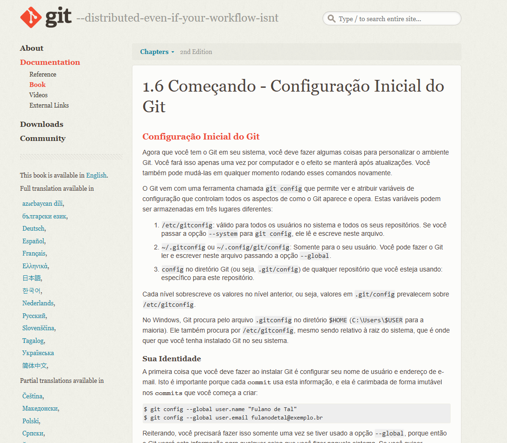
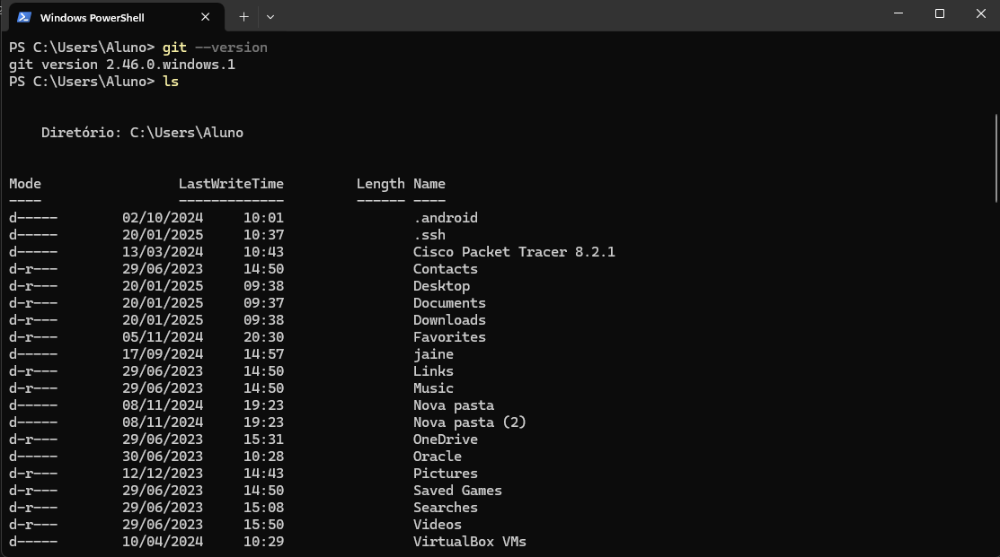
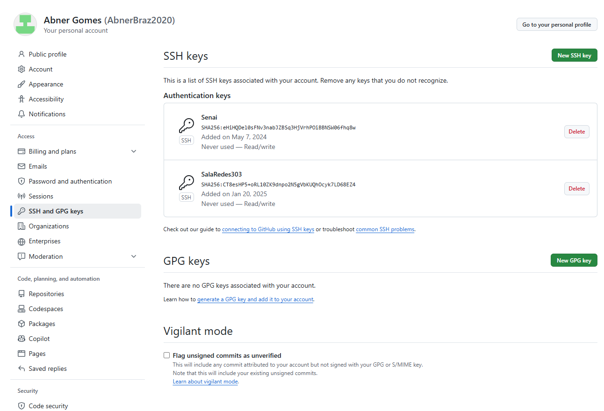
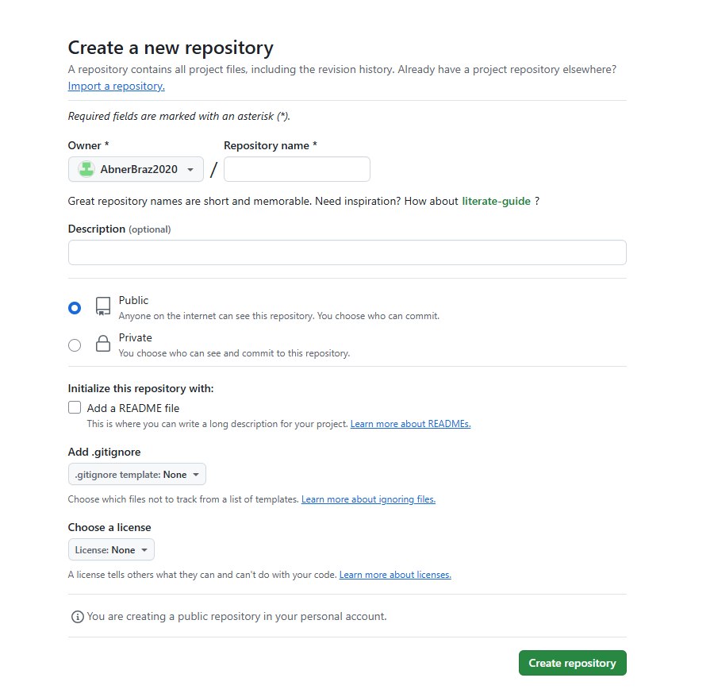
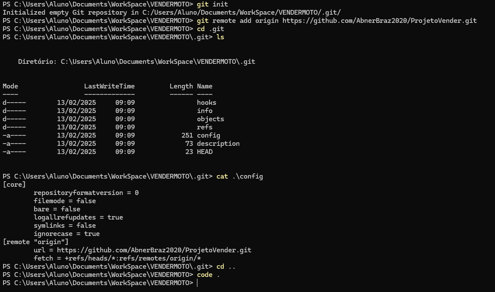

 # MANUAL DE UTILIZAÇÃO DO SISTEMA/SITE
## - DOwNLOAD E INSTALAÇÃO DO GITHUB
Acesse o site do Github para fazer o download do Github.
Quando acessar o site, faça o download do programa (no lugar indicado na imagem).

    

Faça o download da versão que é correspondente ao sistema operacional do seu computador. (32-bit ou 64-bit)

    

Para saber se seu computador é 32 ou 64 bits, siga os passos a seguir.

Vá em Iniciar > Configurações > Sistema > Sobre

         

## - CONFIGURAÇÃO INICIAL
Tutorial de instalação do GIT

 

    Realize a busca do termo [Instalar GIT](https://git-scm.com/book/pt-br/v2/Come%C3%A7ando-Instalando-o-Git) para Windows.

 

    

## - CONFIGURANDO A CONTA GIT PELO TERMINAL
Para acessar o Terminal, vá em Inicial > Pesquisar > Pesquiser por Windows Power Shell.

     

Precisa fazer alguns comandos no Terminal do Windows para configurar o git.

- git --version (Para saber qual versão do git está no seu computador).
- git config --global user.name "Fulano de Tal" (Use o Nome que no Perfil da sua conta do git).
- git config --global user.email fulanodetal@exemplo.br (Use o email que você criou a conta do git).

     

- ssh-keygen (Comando que gera a chave publica e privada, também irá pedir a criação de uma senha).

     

Entre na pasta .ssh/

E use o comando "cat"

##  - CONFIGURANDO GIT
Ao extrair a chave no Terminal, você precisa gravar sua chave no git.
Profile > Setting > SSH and GPG Keys > New SSH Key

     

##  - CRIAÇÃO DO REPOSITORIO
Para criar um repositorio no github.
Vá no seu Perfil

     

Pelo Terminal entre na pasta do projeto e realize os comandos abaixo.

- git init
- git remote add origin
Entre na pasta .git e execute o comando:
- cat .\config

     

e finalize executando o VScode.

Esses comandos servem para que o projeto seja linkado com o github e concluindo o repositorio.

## EXECUTANDO VSCODE

Após linkar o projeto com o github, precisamos executar o VScode para que o projeto possa ser iniciado.

Use o comando mostrado na imagem para executar o projeto no VScode, lembrando que precisa estar dentro da pasta do projeto.

     

## - COMANDOS ADMINISTRATIVOS DO GIT NO TERMINAL DO VSCODE

No Terminal do VScode execute os comandos abaixo:

- git status
- git add .
- git commit -m "Mensagem de desenvolvedor" ex: git commit -m "File update"
- git push -u origion master or main

     

## CLONAR PROJETO DO GITHUB 
git clone (+ link do projeto no git e dentro do diretorio)